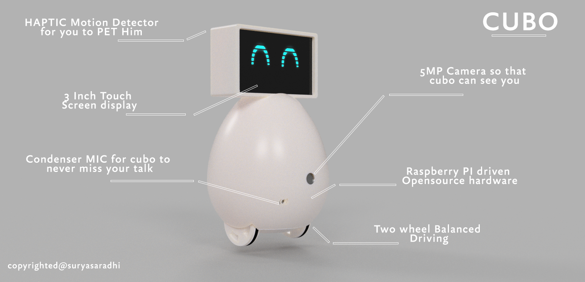

# cuBo

### Autonomous Companion Robot for Modern Homes

**cuBo** is an open-source, interactive, autonomous companion robot designed for modern homes, running on a Raspberry Pi Zero 2 W with Raspberry Pi OS Bullseye Lite. Developed by **Leena Kashyap** and **Suryasaradhi Balarkan**, cuBo blends affordable hardware with AI-based software to deliver:

* Video streaming
* Expressive robotic eye animations
* Voice interaction
* Sensor-based gesture control
* Mobility

cuBo functions as a home automation hub, elderly care companion, educational assistant, and mobile surveillance system, requiring minimal user management. It reacts to touch and voice with emotional expressions, making it an engaging and relatable companion.

For setting up cubo : read implementations.md
---

## 🎯 Purpose

cuBo addresses key challenges in smart home robotics:

* **Emotional Interaction**: Unlike static assistants (e.g., Alexa, Google Home), cuBo offers physical movement and expressive animations.
* **Elderly Care**: Provides companionship, reminders, and emergency alerts for seniors.
* **Affordability**: Uses low-cost components to make personal robotics accessible.
* **Unified Automation**: Acts as a central hub for smart devices, schedules, and communication.

---

## 🚀 Features

* **Video Streaming:** 1080p30 video over UDP with `libcamera-vid` + `ffmpeg` for face/object tracking.
* **Display:** Robotic “RoboEyes” animations on a 3.5” SPI LCD (`/dev/fb0` framebuffer).
* **Audio:** Speech recognition (VOSK/Whisper) and audio playback via I2S.
* **Mobility:** 28BYJ-48 stepper motors for movement (head/wheel), controlled via Arduino Micro.
* **Sensors:** Compass (QMC5883P), TOF sensor (VL53L3CX), touch sensors for gesture input.
* **Automation:** Flask server for smart device control, scheduling, and remote access.

---

## Demo Video 
The below is Unfinished first cuBo prototype


https://github.com/user-attachments/assets/90a2a3a3-cf43-4fe5-9dd7-d7a50253ca3a


## 🧰 Hardware Components

| Component               | Function                                   |
| ----------------------- | ------------------------------------------ |
| Raspberry Pi Zero 2 W   | Main processor (AI, video, audio, control) |
| Arduino Micro           | Motor and sensor control                   |
| OV5640 Camera           | Video streaming & object detection         |
| INMP411 Microphone      | Voice input                                |
| 3.5" SPI LCD            | Display animations/UI                      |
| MAX98357A Speaker       | Audio output                               |
| Touch Sensor            | Gesture/touch detection                    |
| 28BYJ-48 Stepper Motors | Movement (head/wheels)                     |
| ULN2003 Driver Board    | Stepper motor driver                       |
| VL53L3CX TOF Sensor     | Distance measurement (obstacle detection)  |
| QMC5883P Compass        | Orientation detection                      |
| 3.7V Li-ion Battery     | Power source                               |
| TP4056 Module           | Battery charging & protection              |
| 5V Boost Converter      | 5V regulated power                         |
| Flask Server (via WiFi) | Remote control and streaming backend       |

---

## 💾 Software Stack

### Raspberry Pi

* **OS:** Raspberry Pi OS Bullseye Lite
* **Languages:** Python, C++
* **Frameworks:**

  * ROS (sensor & navigation control)
  * Flask (web interface & automation)
  * ORB-SLAM (planned for future navigation)
* **AI:**

  * VOSK/Whisper for speech recognition
  * Ollama (planned for advanced AI chat)
* **Libraries:** `numpy`, `pyserial`, `picamera`, `libcamera-apps`, `ffmpeg`, `U8glib`, `PIGPIO`
* **Networking:** WiFi (video streaming, remote server)

### Arduino

* **Libraries:** `TinyStepper_28BYJ_48`, `ezButton`, `Wire`
* **Functions:** Motor & sensor control, UART bridge for Pi communication

### Design Tools

* **Fusion 360:** CAD modeling
* **KiCad:** PCB design
* **Flutter:** Mobile App (optional)

---

## ⚙️ Setup Instructions

### 1. Raspberry Pi Configuration

* Install Raspberry Pi OS Bullseye Lite
* Network Setup:

  ```bash
  nmap -p 22 --open -sV <subnet>.0/24  # Scan
  ping <ip>                            # Test
  ```
* Enable mDNS:

  ```bash
  sudo apt update
  sudo apt install avahi-daemon
  sudo systemctl enable avahi-daemon
  sudo systemctl start avahi-daemon
  sudo raspi-config  # Set hostname
  ping <hostname>.local
  ```

### 2. Camera & Streaming

* Enable camera (`raspi-config` + `/boot/config.txt`)
* Install tools:

  ```bash
  sudo apt install ffmpeg libcamera-apps tio
  ```
* Stream Video:

  ```bash
  libcamera-vid -t 0 -g 10 --bitrate 4500000 --inline --width 1920 --height 1080 --framerate 30 --rotation 180 --codec libav --libav-format h264 --av-sync 200000 -n -o udp://<receiver-ip>:1234
  ```
* View Stream:

  ```bash
  ffplay -fflags nobuffer -flags low_delay -framedrop udp://<receiver-ip>:1234
  ```

### 3. Audio Setup

* Enable I2S in `/boot/config.txt`:

  ```bash
  dtparam=i2s=on
  dtoverlay=googlevoicehat-soundcard
  ```
* Test Audio:

  ```bash
  aplay -l
  speaker-test
  arecord -d 5 test.wav
  aplay test.wav
  ```

### 4. Display Setup

* Connect 3.5" SPI LCD (via guide)
* Framebuffer Test:

  ```python
  import numpy as np
  fb = np.memmap('/dev/fb0', dtype='uint8', mode='w+', shape=(1024, 1280, 4))
  fb[:] = [255, 0, 0, 255]  # Blue screen
  ```

### 5. Sensor & Motor Control

* Upload Arduino code for stepper motors, buttons, compass, UART.
* Serial communication via `/dev/ttyS0` or `/dev/ttyUSB0`.
* Command Format:

  * `sm` (motor control), `swa` (button input), `cmps` (compass data).

### 6. RoboEyes Animation

* Expressive eye animations at 7 FPS:

  ```python
  robo = RoboEyes(lcd, 480, 320, frame_rate=7, on_show=robo_show)
  robo.set_auto_blinker(True, 4, 2)
  robo.set_idle_mode(True, 5, 2)
  robo.mood = DEFAULT
  robo.curious = True
  ```

---

## 🛠️ Implementation

* **Design:** Modeled in Fusion 360 with multiple design iterations.
* **Hardware:** Integrated stepper motors, sensors, audio, display.
* **Software:**

  * Python: AI, video, audio, LCD, server
  * Arduino: Motor & sensor control
  * Flask: Web interface & remote control
* **Testing:** Verified video streaming, sensor inputs, and animations.

---

## 🏠 Use Cases

* **Home Automation:** Control smart devices and routines.
* **Elderly Care:** Provide companionship, reminders, and emergency alerts.
* **Education:** Engage children with learning tools.
* **Surveillance:** Mobile camera for security monitoring.
* **Ambient:** Display info, play music, and show notifications.

---

## 🔮 Future Plans

* Integrate ORB-SLAM for autonomous navigation.
* Develop IoT backend for device integrations.
* Enhance AI with Whisper or ChatGPT.
* Integrate popular apps (Skype, WhatsApp).
* Connect to Google IoT for alarms and calendars.
* Add native language speech support.
* Design compact PCB for space optimization.
* Upgrade mechanical design with faster motors.
* Improve gesture recognition accuracy.

## 📄 License

MIT License

---

